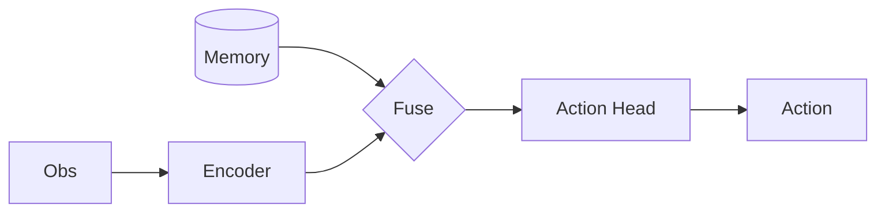

# 论文串讲：<主题>

<贯穿主线的一句话副标题>

<div class="text-sm opacity-60 mt-8">
讲者 · 日期 · 共 N 篇
</div>

<!--
开场:用一句话说清楚为什么把这 N 篇放一起讲(同一问题的演进 / 三种解法 / ...)。
-->

---
layout: default
---

# 总览 · 这次讲什么

<v-clicks>

1. **<Paper A 短名>** — <一句话定位>
2. **<Paper B 短名>** — <一句话定位>
3. **<Paper C 短名>** — <一句话定位>

</v-clicks>

<div class="mt-8 text-sm opacity-70">
主线:<把 N 篇串成一条线 —— 从 X 到 Y,每篇解决前一篇留下的 Z>
</div>

<!--
这一页是串讲的灵魂:听众离场只记得这条主线。
-->

<!-- ===================== 每篇一个 section,可拆到 papers/<arxiv>.md 再 src 引入 ===================== -->

---
layout: section
---

# 1 / <Paper A 短名>
<div class="text-base opacity-70 mt-2">作者 · 会议年份 · arXiv:XXXX.XXXXX</div>

---

# 动机：要解决什么

<v-clicks>

- **痛点**:<之前的方法卡在哪>
- **为什么重要**:<不解决会怎样>
- **机会**:<本文看到的突破口>

</v-clicks>

---
layout: center
class: text-center
---

# 核心 idea

<div class="text-2xl mt-6">
<一句话把"聪明在哪"讲透>
</div>

---
layout: image-right
image: /XXXX.XXXXX/fig_arch.png
---

# Method 框图

<v-clicks>

- 输入 → <模块1> → <模块2> → 输出
- 关键模块:**<本文新增的那块>**
- 数据流要点:<张量怎么走>

</v-clicks>

<div class="text-xs opacity-50 mt-4">图:论文 Figure 2(原图)</div>

<!--
原图够清楚就用原图(image-right);太满/想强调某条流,改用下一页的 Mermaid 重绘。
-->

---

# Method 框图（重绘 · 可选）



---

# 核心代码：<在讲哪段>

```python {1-2|4|6-9|all}{lines:true}
def forward(self, obs):
    feat = self.encoder(obs)            # 编码
    # ...
    z = self.fuse(feat, self.memory)    # ★ 本文关键:与记忆融合
    # ...
    a = self.action_head(z)             # 解码动作
    a = self.unnormalize(a)
    return a
```

<div class="text-xs opacity-60 mt-2">policy/model.py:142 · 官方实现</div>

<!--
讲解节奏:按空格逐步高亮。讲到 fuse 那步停下来讲清楚和上一篇的区别。
-->

---

# 核心代码：<改进点的演进>

````md magic-move
```python
# 朴素做法
out = naive(x)
```
```python
# 本文改法 ★
out = improved(x, extra)
```
````

<div class="text-xs opacity-60 mt-2">train.py:88</div>

---

# 结果

| 设置 | 基线 | 本文 | Δ |
|---|---|---|---|
| <指标1> | xx | **yy** | +z |
| <指标2> | xx | **yy** | +z |

<div class="text-sm opacity-70 mt-4">一句话:<结果说明了什么></div>

<!-- 下一篇:重复上面 section → 动机 → idea → 框图 → 代码 → 结果 -->

<!-- ===================== 跨篇对比收尾 ===================== -->

---
layout: default
---

# 横向对比

| 维度 | Paper A | Paper B | Paper C |
|---|---|---|---|
| 核心方法 | | | |
| 数据/规模 | | | |
| 关键结果 | | | |
| 优点 | | | |
| 局限 | | | |

<!--
这张表是串讲相对单篇讲解的最大增量,务必填实。
-->

---
layout: center
class: text-center
---

# 小结 & 主线回顾

<div class="text-xl mt-6">
<把开头那条主线再说一遍 + 这条线指向的下一步>
</div>

---
layout: center
---

# Thanks

<div class="opacity-70">Q & A</div>
