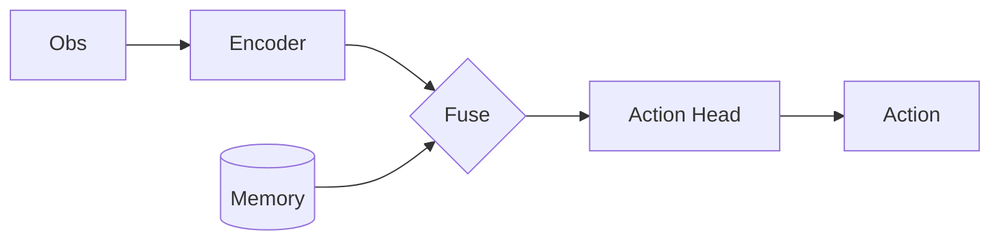

# Slidev 语法手册(论文串讲专用)

只收录装配论文串讲 deck 真正用得到的语法。完整文档 https://sli.dev 。

## 目录
- [文件结构与分页](#文件结构与分页)
- [全局 frontmatter（headmatter）](#全局-frontmatter-headmatter)
- [单页 frontmatter（layout / class / transition）](#单页-frontmatter)
- [代码：逐行高亮（灵魂功能）](#代码逐行高亮)
- [代码：Magic Move 演进动画](#代码magic-move-演进动画)
- [两栏布局（图文对照）](#两栏布局)
- [图片（method 原图）](#图片method-原图)
- [Mermaid（框图重绘）](#mermaid框图重绘)
- [数学公式 KaTeX](#数学公式-katex)
- [逐步揭示 v-click](#逐步揭示-v-click)
- [Presenter notes](#presenter-notes)
- [用 src 拆分每篇论文](#用-src-拆分每篇论文)
- [导出与转 Google Slides](#导出与转-google-slides)

---

## 文件结构与分页

一份 deck 就是一个 `slides.md`。用 `---` 单独成行分隔每一页:

```md
# 第一页标题

内容

---

# 第二页标题

内容
```

第一页的 `---` 之前(或第一页 frontmatter)是**全局 headmatter**;每页开头的 `---\n...\n---` 是**单页 frontmatter**。

## 全局 frontmatter（headmatter）

deck 第一页顶部:

```md
---
theme: seriph          # 学术风推荐 seriph;开发风 default;另有 apple-basic 等
title: 论文串讲 — XXX
favicon: /favicon.png
highlighter: shiki      # 代码高亮引擎,默认 shiki(支持逐行/magic-move)
lineNumbers: true       # 代码块默认显示行号
transition: slide-left  # 翻页动画
mdc: true               # 启用 MDC 语法(组件/属性),建议开
fonts:
  sans: Noto Sans SC    # 中文字体,避免方块
  mono: Fira Code
---
```

主题装在 `package.json` 里(如 `@slidev/theme-seriph`),`new-deck.sh` 已配好 seriph。

## 单页 frontmatter

每页可单独设布局等:

```md
---
layout: section     # 章节分隔页(每篇论文用它起头)
---

# 1 / OpenVLA
> 大词模型 → 机器人动作
```

常用 `layout`:
- `cover` — 封面页
- `section` — 章节分隔(**每篇论文 section 的起头页用这个**)
- `default` — 普通页
- `two-cols` — 两栏(图文对照,见下)
- `image-right` / `image-left` — 一侧整图、另一侧正文(放 method 原图最顺手)
- `center` — 居中(放一句话核心 idea / 金句)
- `fact` / `quote` — 强调一个数字或一句话

其它有用单页字段:`class: text-sm`(整页缩字)、`transition: fade`、`clicks: 3`。

## 代码逐行高亮

**这是论文代码走读的核心。** 在代码块语言后用 `{}` 写要高亮的行,用 `|` 分隔点击步骤——讲到哪、高亮到哪:

````md
```python {1-2|4|6-8|all}{lines:true}
def forward(self, obs):
    feat = self.encoder(obs)          # 1-2: 编码
    # ...
    z = self.fuse(feat, self.memory)  # 4: 与记忆融合 ★ 本文关键
    # ...
    a = self.action_head(z)           # 6-8: 解码动作
    a = self.unnormalize(a)
    return a
```

<div class="text-xs opacity-60 mt-2">policy/model.py:142 · OpenVLA 官方实现</div>
````

- `{1-2|4|6-8|all}`:4 个点击步骤,第一步高亮 1-2 行,第二步只高亮第 4 行……最后 `all` 全亮。讲解时按空格/方向键推进。
- `{lines:true}` 显示行号;`{startLine:140}` 让行号从 140 开始(对齐真实 file:line)。
- 代码太长:`{maxHeight:'400px'}` 加滚动;高亮行会自动滚到视口。
- **每段代码下用小字标 `file:line`**(上例的 `<div>`),来自 `02_technical.md`,证明是真代码。

## 代码：Magic Move 演进动画

讲"从朴素实现 → 本文改法",或代码逐步长出来,用 magic-move:同一块代码在多个版本间**平滑变形**,逐次点击切换。用 ` ````md magic-move ` 包住多个代码块:

`````md
````md magic-move
```python
# 朴素:每步都重算全部 KV
attn = softmax(q @ k.T) @ v
```
```python
# 本文:缓存历史 KV,只算新 token  ★
k = cat([self.kv_cache, k_new])
attn = softmax(q @ k.T) @ v
self.kv_cache = k
```
````
`````

每个 ```` ``` ```` 代码块是一个步骤,点击在相邻版本间做 token 级 diff 动画。讲"改进点"时极有说服力。

## 两栏布局

`layout: two-cols`,用 `::right::` 分隔(左栏在前,无需 `::left::`;要显式可用 `::left::`):

```md
---
layout: two-cols
layoutClass: gap-8
---

## Method

- 输入:RGB + 指令
- 编码器:ViT-L
- 关键:记忆库 read/write

::right::


```

## 图片（method 原图）

抽出的图放 deck 的 `public/` 目录(`new-deck.sh` 已建),Slidev 把 `public/` 当根,引用时用 `/` 开头的绝对路径(**不要**写 `./public/...`):

```md

```

控制尺寸/位置(mdc 语法):

```md
{width=480px class="mx-auto rounded shadow"}
```

整页大图最稳:用 `layout: image` + frontmatter 里 `image: /xxx.png`;或 `layout: image-right` 把图甩到右半屏、左半写讲解。HTML `` 也行,方便加定位 class。

## Mermaid（框图重绘）

原图不够清楚时,直接在 slide 写 Mermaid 画 pipeline / 数据流:

````md

````

- `{scale: 0.7}` 缩放以适配页面。
- 适合 flowchart(架构/数据流)、sequence(交互时序)。导出 PPTX 时 Mermaid 会被渲染成图片嵌入。
- 复杂/要精修的框图用 `drawio` skill 出 svg/png 再当图片插入,别硬用 Mermaid 堆。

## 数学公式 KaTeX

行内 `$\mathcal{L} = \mathbb{E}[\|a - \hat a\|^2]$`;独立公式:

```md
$$
\mathcal{L}_{\text{flow}} = \mathbb{E}_{t,x_0,x_1}\big[\| v_\theta(x_t,t) - (x_1-x_0) \|^2 \big]
$$
```

讲 loss / objective / 采样过程时用,比纯文字清楚。可加 `{1|2}` 对多行公式逐行揭示。

## 逐步揭示 v-click

让要点一条条出现(配合讲解节奏):

```md
<v-clicks>

- 第一点(先出)
- 第二点(点一下才出)
- 第三点

</v-clicks>
```

单个元素用 `<v-click>...</v-click>`。代码用上面的 `{a|b|c}` 已经自带分步,不必再包 v-click。

## Presenter notes

每页最后用 HTML 注释写演讲备注,只在 presenter 模式(`npm run dev` 按 `p`)可见——把"想说但不想上屏"的话放这:

```md
# 这页标题

要点...

<!--
这里是讲稿:展开讲为什么这个 fuse 是关键,对比上一篇的做法。
听众可能问 X,准备好答 Y。
-->
```

## 用 src 拆分每篇论文

大 deck 串讲多篇时,把每篇拆成单独文件,主 `slides.md` 只放封面/总览/收尾 + 引入:

```md
---
src: ./papers/2406.09246.md
---

---
src: ./papers/2410.12345.md
---
```

`papers/<arxiv>.md` 里写该篇的所有页(第一页用 `layout: section` 起头)。好处:主文件可读、每篇可单独迭代、并行装配不打架。被引入文件的第一页 frontmatter 会和引入处合并。

## 导出与转 Google Slides

```bash
# dev(主交付:浏览器现场讲,动画/交互全保留)
npm run dev          # → http://localhost:3030 ;presenter 模式访问 /presenter

# 导出(需要 playwright-chromium,package.json 已含)
npx slidev export --format pdf          # PDF 讲义/存档
npx slidev export --format pptx         # PPTX(每页转成图;Mermaid/代码渲染为图片嵌入)
npx slidev export --format png --output slides-png/   # 逐页 PNG
```

> 注意:PPTX 导出是**每页作为图片**,文本/代码不可再编辑。要在 PPTX/Google Slides 里二次编辑文字,得手动重排,或改用 marp/原生方式。串讲场景一般以 HTML 现场讲为主,PPTX 只作分享存档。

**PPTX → 原生 Google Slides**(Drive 自动转换):上传 `.pptx` 时把目标 `mimeType` 设成 `application/vnd.google-apps.presentation`,Drive 会转成可编辑的 Google Slides。本机连了 `gogcli-slides` MCP:
- 用其 Drive/Slides 上传工具上传导出的 pptx 并指定转换 mimeType;或
- 若只是要一份 Slides 大纲,`gog_slides_create_from_markdown` 可从 markdown 直接建原生 Slides(版式弱于 Slidev,但完全可编辑)。

两种交付权衡:**Slidev HTML/PDF** = 代码动画 + 框图最好看,但不可在 Slides 里改字;**Google Slides** = 可协作可编辑,但 Slidev 的逐行/magic-move 动画会丢失(变静态图)。按用户实际分享需求选。
